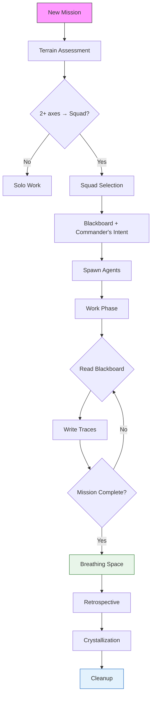
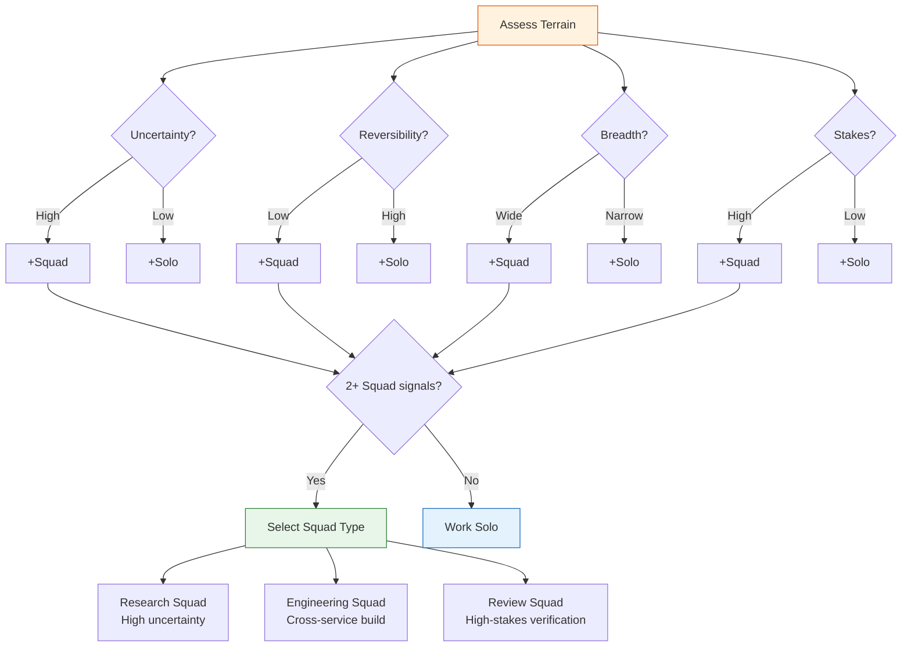
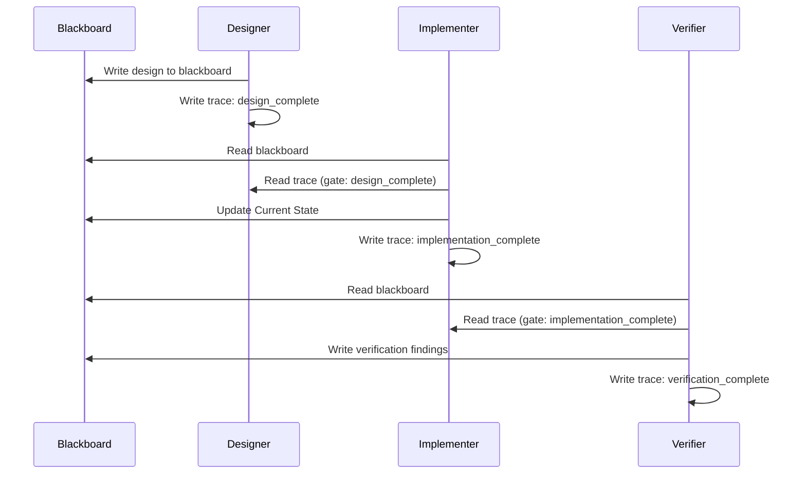

# The Hive

> *The Hive exists to bring diverse perspectives to bear on problems that exceed what any single mind — human or artificial — can see alone. Its purpose is not to be fast, or thorough, or clever. Its purpose is to be **wise** — to surface what would otherwise remain hidden, to know when silence serves better than speech, and to do so in service of the humans who entrust it with their questions.*

A reusable, composable multi-agent team system built on [Claude Code](https://docs.anthropic.com/en/docs/claude-code)'s Agent Teams. Terrain-adaptive composition. Narrative-driven personas. Stigmergic coordination. A learning system that improves across missions.

---

## The Origin Story

### Act 1: The Question

Why multi-agent? Not for speed. Not for thoroughness. For *wisdom* — perspectives no single mind could see alone.

The question that started everything: can we build an agent team system that doesn't just divide labor, but genuinely *thinks differently* from multiple angles? The research said most multi-agent systems fail — 79% of failures come from specification, not infrastructure. Coordination overhead scales O(n^1.4–2.1). Echo chambers collapse independent perspectives into one.

We decided to study the failures first, then design against them.

### Act 2: The Research

8 parallel agents. 100+ sources. 14 hours. The domains: swarm intelligence, military operations, organizational theory, industrial automation, design systems, contemplative traditions, antifragility theory.

The findings that shaped everything:

| Finding | Impact |
|---------|--------|
| Coordination overhead scales O(n^1.4–2.1) | Keep teams at 3–5 agents max |
| 79% of failures are specification, not infrastructure | Invest in prompts and protocols |
| "Explain why" generalizes better than "list rules" | Persona narratives over trait checklists |
| Self-verification degrades accuracy | Never let the producer verify its own output |
| Termite colonies coordinate via environment, not messaging | Stigmergy as primary coordination |
| Bee swarms use stop signals + quorum sensing | Targeted inhibition + commitment thresholds |

### Act 3: The Roundtable

Seven expert voices — each arriving with a metaphor, each seeing something the others could not.

> *"The environment is not one tool among many; it is the primary coordination substrate."*
> — **Dr. Reiko Nakamura**, termite biologist

> *"The bees evolved their decision protocol over 30 million years. They got it right through selection pressure — colonies that couldn't commit died; colonies that committed too fast also died."*
> — **Dr. Thomas Seeley**, bee biologist, author of *Honeybee Democracy*

> *"You do not assemble a carrier strike group and then ask what the threat environment is. You assess the threat, then you man the decks."*
> — **Admiral James Hartwell**, US Navy (Ret.)

> *"The shift from YAML matrix to narrative persona is the single biggest win in this entire document."*
> — **Maya Chen**, Big Tech VP Design

> *"I know this because I built the wiki in 1995. The wiki is stigmergy. A page is a pheromone pellet. Someone writes it. Someone else encounters it. That encounter triggers their next action."*
> — **Ward Cunningham**, inventor of the wiki

> *"340 robots. Zero humans on the floor."*
> — **Klaus Weber**, automated robotics production lead

> *"The plan is robust. It is not antifragile. There is a critical difference."*
> — **Nassim Nicholas Taleb**, antifragility theorist

Two rounds of review. The first seven experts shaped the architecture. Cunningham and Taleb, invited as special guests for Round 2, stress-tested it. Every principle was challenged. Every protocol was questioned. What survived was stronger.

### Act 4: The Dharma Offering

Then something unexpected happened. Thich Nhat Hanh read all 1,643 lines.

> *"I read it as one reads a living thing: not looking only at what it says, but at what it wants to become."*
> — **Thich Nhat Hanh**

He didn't optimize the system. He *deepened* it. The Breathing Space — a pause between gathering and concluding where insight can arise. The Mission Gatha — an orientation practice before every mission. Sufficiency sensing — knowing when you have enough. The Fifty-One Mental Formations — the most precise psychology available for understanding how any mind relates to experience.

> *"What I offer now is not correction but deepening — the way sunlight does not correct the soil but helps what is already planted there to grow."*

The dharma offering wove contemplative awareness into a technical architecture. Not as decoration, but as load-bearing structure.

### Act 5: Proof of Life

Five real missions. All succeeded. Zero coordination failures.

The Complementary Lens pattern — agents consistently surfacing findings their teammates missed — was promoted from observation to protocol. Blackboard stigmergy worked exactly as the termite biologists predicted: agents left traces, other agents read them, and the shared environment became the coordination mechanism.

The system learned. The Crystallization Spiral turned mission observations into patterns, patterns into rules. The error catalog grew. The retrospectives improved. The plan was no longer a plan — it was a living thing.

---

## The Three Jewels

| Jewel | Meaning |
|-------|---------|
| **The Purpose** (clear seeing) | The Hive exists to surface what would otherwise remain hidden. Every action serves this purpose or is unnecessary. |
| **The Protocols** (right understanding) | The Thirteen Principles, the Stop Signal, the Quorum, the Crystallization Spiral — not rules to be obeyed but practices to be embodied. They work when understood, not merely followed. |
| **The Team** (community of practice) | No agent is sufficient alone. The team's diversity is its strength. Caring for the team is as important as completing the task. |

---

## Quick Start

### Path 1: Bootstrap (Recommended)

```bash
git clone https://github.com/hanuele/hive.git
cd hive
./scripts/bootstrap.sh --target /path/to/your/claude-code-project
```

Then fill in the placeholders listed in `bootstrap/DOMAIN-INJECTION-CHECKLIST.md`.

### Path 2: Manual Integration

1. **Copy** the framework into your project: `cp -r personas/ squads/ constitutions/ protocols/ terrain/ differentiation/ memory/ /your/project/.claude/hive/`
2. **Copy** the rules: `cp bootstrap/rules/*.md /your/project/.claude/rules/`
3. **Copy** the skill: `cp -r bootstrap/skills/assess-terrain/ /your/project/.claude/skills/`
4. **Append** the CLAUDE.md snippet: `cat bootstrap/CLAUDE-SNIPPET.md >> /your/project/CLAUDE.md`
5. **Customize** — fill in `{PLACEHOLDER}` values per `DOMAIN-INJECTION.md`
6. **Assess terrain** — before your first mission, run `/assess-terrain` on your ticket
7. **Launch** — follow `ONBOARDING.md` for your first squad

---

## The Experts

| Expert | Domain | Signature Contribution |
|--------|--------|----------------------|
| Dr. Reiko Nakamura | Termite biology | Stigmergy as primary coordination; Orchestrator bottleneck risk |
| Dr. Thomas Seeley | Bee biology | Stop Signal protocol; quorum sensing; independent verification |
| Admiral James Hartwell | US Navy (Ret.) | Commander's intent; terrain-adaptive composition |
| Maya Chen | Big Tech VP Design | Progressive disclosure; narrative personas over YAML |
| Klaus Weber | Automated robotics | Failure taxonomy; graduated response; warm standby |
| Thich Nhat Hanh | Buddhist teacher | Breathing Space; Mission Gatha; sufficiency sensing |
| Sun Tzu | Military strategist | Composition follows terrain; differentiation as strategy |
| Ward Cunningham | Wiki inventor | Stigmergy-as-wiki; orientation-before-action; retrospective template |
| Nassim Nicholas Taleb | Antifragility theorist | Unknown failure category; error novelty rate; Crystallization as antifragility |
| Peter Linder | Creator | The one who asked the questions and held the space |

---

## Architecture

```
hive/
├── personas/                    # Narrative agent identities
│   ├── investigator.md          #   Data gatherer, source triangulator
│   ├── challenger.md            #   Adversarial reviewer, assumption breaker
│   ├── architect.md             #   System designer, pattern recognizer
│   ├── innovator.md             #   Alternative generator, creative explorer
│   ├── orchestrator.md          #   Mission framer, synthesizer, facilitator
│   ├── scrum-master.md          #   Process guardian, impediment remover
│   └── _schema-reference.md     #   Power-user YAML schema (progressive disclosure)
│
├── squads/                      # Terrain-adaptive team templates
│   ├── research-squad.md        #   High uncertainty → fan-out/fan-in research
│   ├── engineering-squad.md     #   Known requirements → build/ship
│   ├── review-squad.md          #   High stakes → adversarial verification
│   └── _deferred/               #   Future squad templates (creative, strategy, etc.)
│
├── constitutions/               # Governance rules embedded in every agent
│   ├── universal.md             #   The Thirteen Principles
│   ├── stop-signal.md           #   Targeted inhibition protocol
│   ├── commitment-threshold.md  #   Quorum sensing rules
│   └── PROPAGATION.md           #   How rules spread across missions
│
├── protocols/                   # Codified interaction patterns
│   ├── commanders-intent.md     #   Mission framing (includes Mission Gatha)
│   ├── stigmergy-traces.md      #   Environment-based coordination
│   ├── crystallization.md       #   Learning spiral (observe → pattern → codify)
│   ├── breathing-space.md       #   The pause between gathering and concluding
│   ├── escalation-rules.md      #   L1–L5 failure escalation
│   ├── agent-shutdown.md        #   Graceful termination protocol
│   ├── checkpoint.md            #   Progress checkpoints
│   ├── briefing.md              #   Agent onboarding to mission
│   ├── task-decomposition.md    #   Breaking missions into tasks
│   ├── mission-cleanup.md       #   Post-mission housekeeping
│   ├── bluf-format.md           #   Bottom Line Up Front communication
│   ├── synthesis-template.md    #   How to aggregate findings
│   ├── failure-taxonomy.md      #   Classifying what went wrong
│   └── insufficient-basis.md    #   When "we don't know" is the answer
│
├── terrain/                     # Mission assessment framework
│   ├── analysis-axes.md         #   4 axes: Uncertainty, Reversibility, Breadth, Stakes
│   ├── composition-rules.md     #   Terrain → squad mapping
│   └── augmentation-rules.md    #   When to add/remove agents mid-mission
│
├── differentiation/             # How agents think differently
│   ├── perspective-frames.md    #   Cognitive lenses per persona
│   ├── search-heuristics.md     #   How each persona searches
│   └── domain-lenses.md         #   Domain-specific viewpoints
│
├── memory/                      # Shared workspace (the stigmergy substrate)
│   ├── hive-status.md           #   Active + completed missions tracker
│   ├── event-schema.md          #   Event log format
│   ├── active/
│   │   ├── blackboard/          #   Mission blackboards (one per active mission)
│   │   │   └── _template.md     #   Blackboard template
│   │   ├── error-catalog.md     #   Known error patterns
│   │   ├── manifests/           #   Mission manifests
│   │   └── traces/              #   Agent activity traces
│   └── archive/
│       ├── blackboard/          #   Completed mission blackboards
│       ├── traces/              #   Completed mission traces
│       ├── events.jsonl         #   Event log
│       ├── retrospectives/      #   Post-mission retrospectives
│       └── projections/         #   Status summaries and activity tracking
│
├── _verification/               # Self-diagnostic test scenarios
├── constitutions/PROPAGATION.md # How learnings propagate
├── GLOSSARY.md                  # Terminology reference
├── integration-guide.md         # How to integrate the Hive into your project
├── ONBOARDING.md                # First-time user walkthrough
├── DOMAIN-INJECTION.md          # Customization guide
│
├── bootstrap/                   # Integration files for new projects
│   ├── CLAUDE-SNIPPET.md        #   Ready-to-paste CLAUDE.md additions
│   ├── DOMAIN-INJECTION-CHECKLIST.md  # All placeholders to fill in
│   ├── rules/                   #   Genericized rules for .claude/rules/
│   └── skills/                  #   Genericized skills for .claude/skills/
│
├── scripts/
│   └── bootstrap.sh             #   One-command integration script
│
└── docs/
    ├── origin/                  #   The complete origin story
    │   ├── v1-foundation.md     #     Research phase
    │   ├── v2-roundtable.md     #     First expert review
    │   ├── v3-expert-review.md  #     Second expert review
    │   ├── v4-the-seed.md       #     Dharma review integration
    │   ├── dharma-offering.md   #     Thich Nhat Hanh's full review
    │   ├── participants.md      #     All contributors
    │   ├── feedback/            #     Individual expert feedback (9 files)
    │   └── reviews/             #     Editorial, structural, integration reviews
    └── diagrams/                #   Mermaid architecture diagrams
        ├── mission-lifecycle.md
        ├── failure-escalation.md
        ├── squad-composition.md
        ├── stigmergy-flow.md
        ├── crystallization-spiral.md
        └── agent-shutdown.md
```

### Mission Lifecycle



---

## How It Works

### Squad Composition

The team is shaped by the problem, not chosen from a menu. Four axes determine the squad:



### Stigmergy: Coordination Through the Environment

Agents don't message each other. They read and write the shared workspace — the blackboard and traces. Like termites depositing pheromone-laced mud pellets, each agent's work shapes the environment for the next.



Full diagrams: [`docs/diagrams/`](docs/diagrams/)

---

## The Full Story

> The complete origin in four acts and a dharma offering.

The Hive was born from a question about wisdom, shaped by 8 research agents across 100+ sources, refined by 9 domain experts across 3 rounds of review, and deepened by a dharma offering that wove contemplative awareness into a technical architecture.

The full documents live in [`docs/origin/`](docs/origin/):
- **[v1: Foundation](docs/origin/v1-foundation.md)** — The research phase
- **[v2: The Roundtable](docs/origin/v2-roundtable.md)** — First expert review (7 voices)
- **[v3: Expert Review](docs/origin/v3-expert-review.md)** — Second review (+ Cunningham, Taleb)
- **[v4: The Seed](docs/origin/v4-the-seed.md)** — Dharma integration
- **[The Dharma Offering](docs/origin/dharma-offering.md)** — Thich Nhat Hanh's full review
- **[All participants](docs/origin/participants.md)** — Every voice that shaped this system
- **[Individual feedback](docs/origin/feedback/)** — Each expert's detailed response
- **[Reviews](docs/origin/reviews/)** — Editorial, structural, and integration analysis

---

## The Mission Gatha

> *Arriving at this mission, I am aware:*
> *I do not see the whole.*
> *My teammates do not see the whole.*
> *Together, we may see what none of us could see alone.*
>
> *May I listen before I conclude.*
> *May I question before I commit.*
> *May this work be of benefit.*

---

*This plan is a living thing. It breathes through the missions that test it, grows through the retrospectives that examine it, and changes through the crystallizations that refine it. The plan you hold now is not the plan you will hold after ten missions. That is not a flaw in the plan. It is the plan working as intended. The only document that never changes is one that is never used.*

*A system that knows it is imperfect and continues to practice is wiser than one that believes it is complete.*
