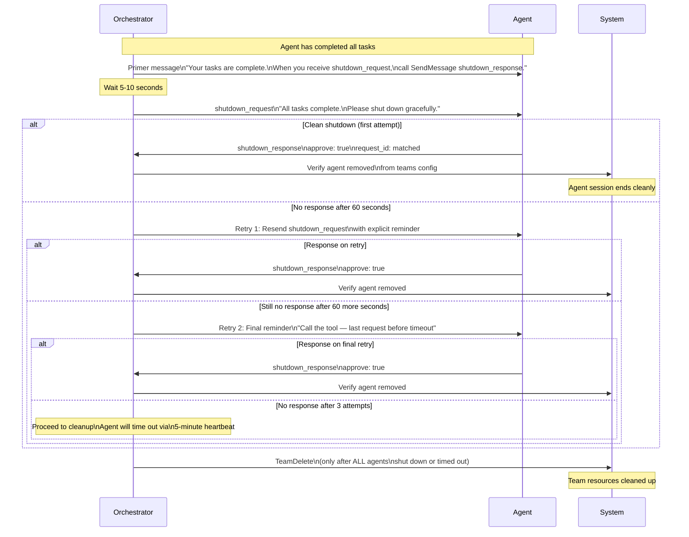

# Agent Shutdown

Graceful agent shutdown requires a two-step approach: a primer message re-activates a potentially idle agent and refreshes the shutdown instruction, followed by the formal shutdown_request. Every agent spawn prompt must include an explicit shutdown handling section instructing the agent to call the SendMessage tool rather than acknowledge the request in text. If an agent fails to respond after three attempts, the team proceeds to cleanup and the agent will time out naturally.

