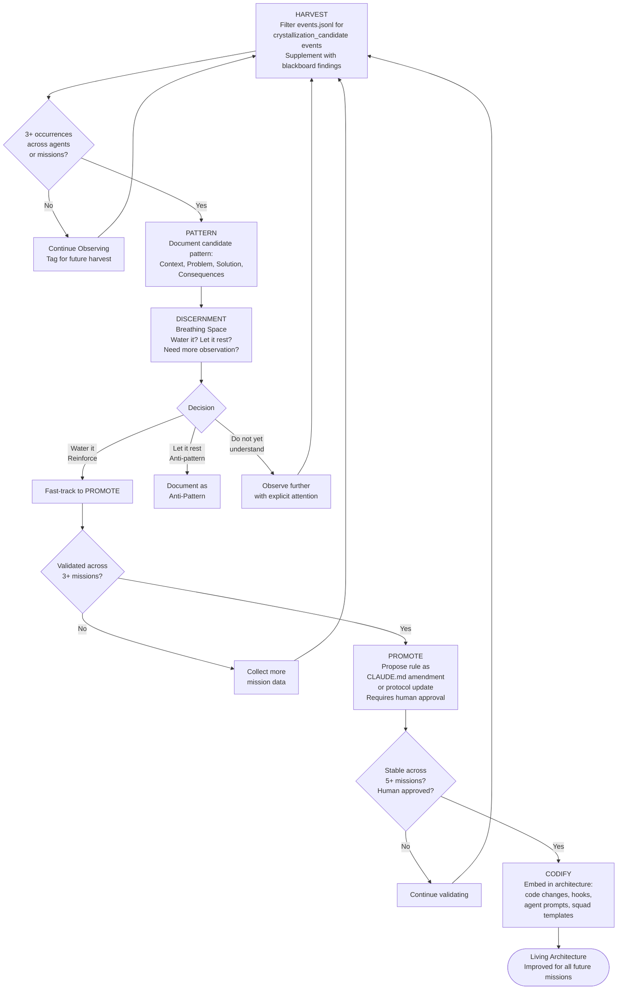

# Crystallization Spiral

Knowledge flows from raw observation during a mission toward codified architecture over many missions. This is the Hive's long-term learning mechanism — not any single mission's output, but the system's accumulated ability to recognize patterns and improve its own protocols. The Discernment step distinguishes this from a neutral learning system: agents actively decide which patterns to reinforce and which to treat as anti-patterns.

