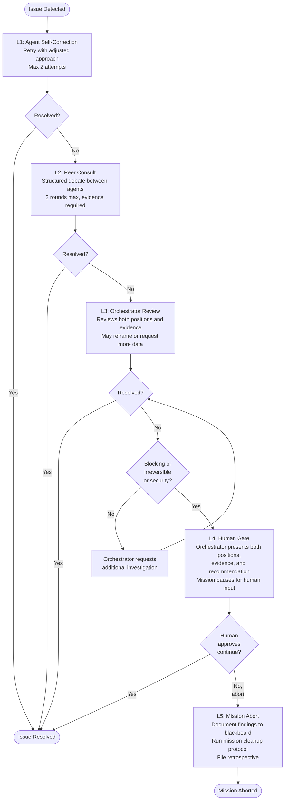

# Failure Escalation

When agents encounter disagreements or blocking issues, The Hive uses a structured five-level escalation path. Each level attempts resolution before passing to the next. The path is designed so that routine disagreements are resolved between agents (L1-L2), significant or irreversible decisions involve the Orchestrator (L3), blocking issues require a human gate (L4), and unresolvable situations trigger a mission abort (L5).

