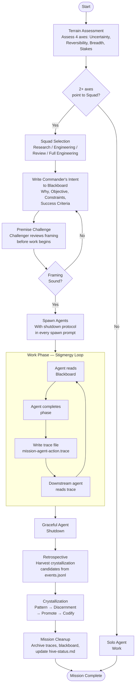

# Mission Lifecycle

Every Hive mission follows a structured lifecycle from terrain assessment through knowledge crystallization. The stigmergy work phase is a feedback loop where agents coordinate through shared trace files and a blackboard rather than direct messaging. The retrospective and crystallization steps ensure that learning from each mission accumulates into the system's protocols over time.

