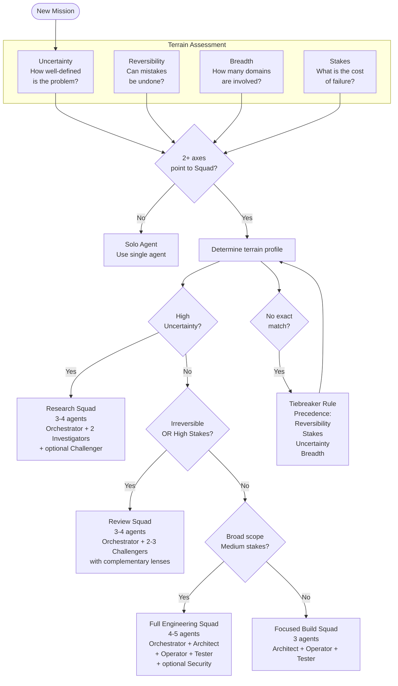

# Squad Composition

Before assembling a team, the Orchestrator assesses the mission along four terrain axes. If two or more axes point toward a squad approach, the specific axis profile determines which squad type is most appropriate. When no template matches exactly, a tiebreaker rule applies precedence ordering to select the closest match.

