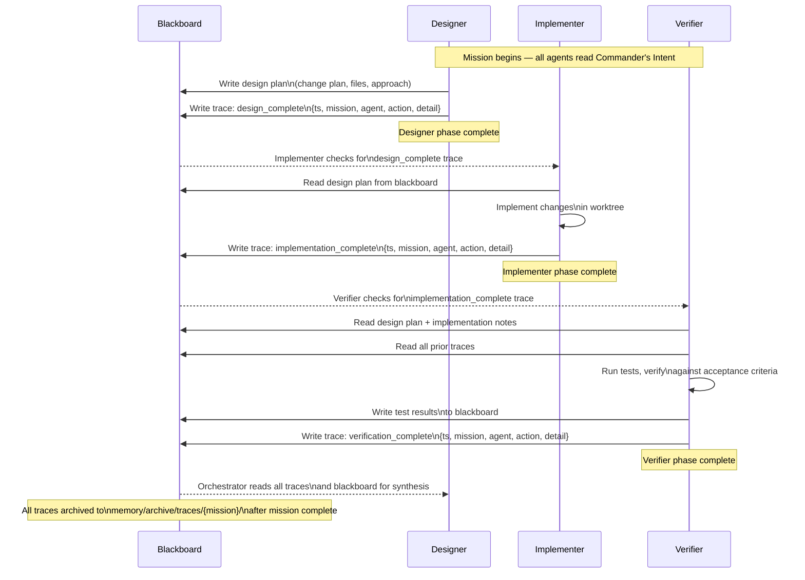

# Stigmergy Flow

Agents in a sequential pipeline coordinate through shared trace files written to the filesystem rather than through direct messaging. This is stigmergy — coordination through a shared environment. The blackboard holds the content of what each agent produced; the trace files signal that a phase is complete and a downstream agent may proceed.

